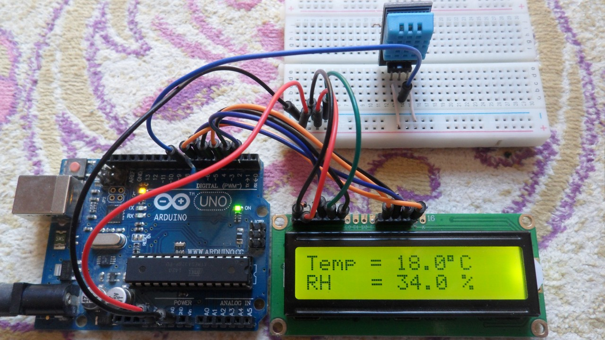

# Smart Environmental Monitor

## Overview

This project interfaces a DHT11 temperature and humidity sensor with an Arduino Uno.

The sensor data is collected every 2 seconds and displayed on the Arduino Serial Monitor, by varying the room temperature around we can see the updates in every 2 secs.

## Components Used

- Arduino Uno
- DHT11 Sensor
- Jumper Wires
- USB Cable
- LCD of 16x2
## Circuit Image

## Connections

| DHT11 | Arduino Uno |
|--------|-------------|
| VCC | 5V |
| DATA | Pin 2 |
| GND | GND |

## Output

Temperature: 18°C

Humidity: 34%

## Skills Learned

- Arduino Programming
- Sensor Interfacing
- GPIO
- Serial Communication
- Environmental Monitoring
